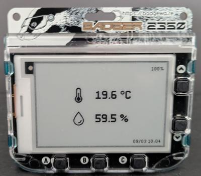
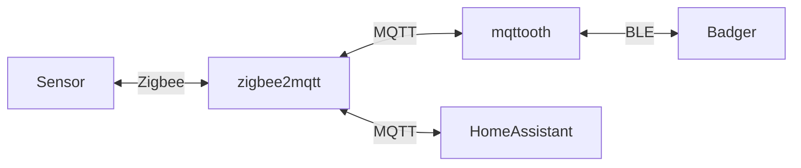

# mqttooth

[![CI][status-png]][status]
[![crates][crates-png]][crates]

`mqttooth` is the server-side companion for the `mqttooth` app running on
the Pimoroni Badger 2350 e-ink display. See [my 
fork](https://github.com/jecaro/badger2350) of the Badger repository for 
installing it on your device.

  

`mqttooth` is a bridge that subscribes to MQTT topics ([zigbee2mqtt]) and 
exposes sensor data over Bluetooth Low Energy (BLE) using the standard 
Environmental Sensing service.

It has been developed to support the sensor [Sonoff 
SNZB-02P](https://www.zigbee2mqtt.io/devices/SNZB-02P.html).

[crates-png]: https://img.shields.io/crates/v/mqttooth
[crates]: https://crates.io/crates/mqttooth
[status-png]: https://github.com/jecaro/mqttooth/actions/workflows/nix-build.yml/badge.svg
[status]: https://github.com/jecaro/mqttooth/actions
[zigbee2mqtt]: https://www.zigbee2mqtt.io/
